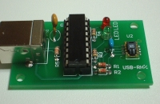
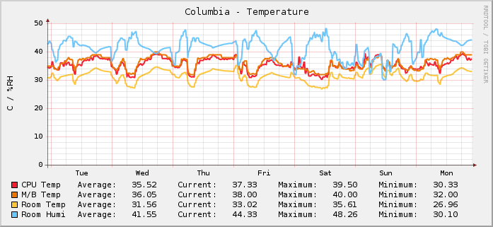
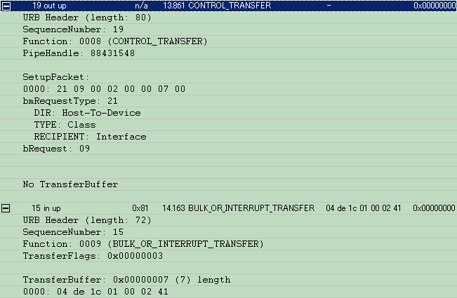

======================================================================
USBRH driver for Linux
======================================================================


.. contents::

|GoogleAdSense|

USBRH とは？
----------------------------------------------------------------------

`USBRH`_ は `ストロベリーリナックス`_ から発売されている温度・湿度測定
ユニットです．USB 経由でセンサーの値を取得できます．



USBRH の詳しい仕様については `こちら
<http://www2.strawberry-linux.com/products/usbrh/>`_ を参照してください．

このページでは，USBRH の Linux 用ドライバを配布しています．


ライセンス
----------------------------------------------------------------------

`GNU General Public License`_ （ `GNU General Public License の翻訳`_
）に従います．

|download|
----------------------------------------------------------------------

* `usbrh-0.0.8.tgz <http://green-rabbit.sakura.ne.jp/usbrh/dist/usbrh-0.0.8.tgz>`_ (`古いバージョン <dist/>`_)


動作環境
----------------------------------------------------------------------

Linux Kerel 2.6 以降で動作します．udev を使用していることを想定していま
す．

開発は， `Ubuntu Linux`_ Kernel **3.5.0** で行っています．


インストール
----------------------------------------------------------------------

::

  $ make
  $ su - 
  % sudo make install


使い方
----------------------------------------------------------------------

ドライバをインストールした後，USBRH をパソコンに接続すると
`/proc/usbrh/[番号]` というディレクトリが生成されます．[番号]は 0 から
始まり，接続される USBRH の個数が増える度に 1 ずつ増えます．

USBRH のセンサーの値はこの中にある以下のファイルを読み出すことで取得で
きます．

temperature
  温度(C) を出力します．

humidity
  相対湿度(%RH) を出力します．

status
  「t:温度 h:相対湿度」の形式で，温度と相対湿度の両方の値を出力します．

出力例
``````````````````````````````````````````````````````````````````````
::

  $ ls -la /proc/usbrh/0
  合計 0
  dr-xr-xr-x 2 root root 0 2008-04-05 02:46 ./
  dr-xr-xr-x 3 root root 0 2008-04-05 02:46 ../
  -rw-r--r-- 1 root root 0 2008-04-05 02:46 heater
  -r--r--r-- 1 root root 0 2008-04-05 02:46 humidity
  -rw-r--r-- 1 root root 0 2008-04-05 02:46 led
  -r--r--r-- 1 root root 0 2008-04-05 02:46 status
  -r--r--r-- 1 root root 0 2008-04-05 02:46 temperature
  $ cat /proc/usbrh/0/temperature
  30.05
  $ cat /proc/usbrh/0/humidity
  35.02
  $ cat /proc/usbrh/0/status
  t:30.07 h:34.95


トラブルシューティング
----------------------------------------------------------------------

USBRH を接続しても `/proc/usbrh` が現れない場合は以下の点を確認してください．

USBRH がパソコンに認識されているか
``````````````````````````````````````````````````````````````````````

下記のように `lsusb` を実行して，ID 1774:1001 のデバイスが表示される
ことを確認してください．

::

  $ su -
  # lsusb -d 0x1774:0x1001
  Bus 004 Device 002: ID 1774:1001

ドライバがロードされているか
``````````````````````````````````````````````````````````````````````

下記のように `lsmod` を実行して，usbrh が表示されることを確認してくだ
さい．

::

  $ lsmod
  Module                  Size  Used by
  usbrh                   5636  0

* ドライバがデバイスを認識しているかどうか

`dmesg` を実行して，下記のように「USBRH device now attached to
/dev/usbrh[番号]」という出力がある事を確認してください．

::

  $ dmesg
  [    6.377870] usb 1-1.4: USBRH device now attached to /dev/usbrh1

無い場合は，USBRH を一旦 PC から外し，再び接続してみてください．

ドライバをロードしてから，デバイスを接続しているか
``````````````````````````````````````````````````````````````````````

`make install` によってドライバをロードしてから，デバイスを接続してくだ
さい．デバイスを接続してからドライバをロードした場合，うまくデバイスを
認識できません．その場合，一旦デバイスを抜き差ししてください．

活用例
----------------------------------------------------------------------

`RRDtool`_ などと組み合わせれば，温度と湿度の変化を簡単にグラフ化できま
す．以下は，部屋の温度と湿度，そしてコンピュータ内の温度をプロットした
ものです．




おまけ機能
----------------------------------------------------------------------

このドライバでは，USBRH についている 2 つの LED とセンサーに内蔵されて
いるヒータを制御する事も可能です．

LED の制御
``````````````````````````````````````````````````````````````````````

`/proc/usbrh/[番号]/led` に値を書き込むことで LED の制御が行えます．

::

  $ sudo su
  [緑色の LED を点灯]
  # echo 1 > /proc/usbrh/0/led
  [赤色の LED を点灯]
  # echo 2 > /proc/usbrh/0/led
  [緑色と赤色の LED を点灯]
  # echo 3 > /proc/usbrh/0/led


ヒータの制御
``````````````````````````````````````````````````````````````````````

`/proc/usbrh/[番号]/heater` に値を書き込むことで LED の制御が行えます．

::

  $ sudo su
  [ヒータをオン]
  # echo 1 > /proc/usbrh/0/heater
  
  # cat /proc/usbrh/0/temperature
  30.78
  # cat /proc/usbrh/0/temperature
  31.69
  # cat /proc/usbrh/0/temperature
  32.19

  [ヒータをオフ]
  # echo 0 > /proc/usbrh/0/heater
  
  # cat /proc/usbrh/0/temperature
  29.42
  # cat /proc/usbrh/0/temperature
  28.74


制御方法について
----------------------------------------------------------------------

このドライバは，以下の情報に基づいて作成しました．

* USBRH に付いてくる，サンプルアプリケーション `usbrhdemo/Project1.exe` の表示
* `SnoopyPro`_ で取得した USB の通信ログ
* USBRH のセンサーチップ `SHT11`_ の `データシート`_

センサーの値を取得する際の通信ログを下記に示します．



.. _`USBRH`:                    http://www2.strawberry-linux.com/products/usbrh/
.. _`ストロベリーリナックス`:   http://strawberry-linux.com/
.. _`Ubuntu Linux`:             http://www.ubuntu.com/
.. _`SHT11`:                    http://www.sensirion.com/en/02_sensors/03_humidity/00_humidity_temperature_sensor/02_humidity_sensor_sht11.htm
.. _`データシート`:             http://green-rabbit.sakura.ne.jp/usbrh/sht_datasheet_j.pdf
.. _`SnoopyPro`:                http://sourceforge.net/projects/usbsnoop/
.. _`GNU General Public License`: http://www.gnu.org/licenses/gpl.html
.. _`GNU General Public License の翻訳`: http://opentechpress.jp/docs/licenses/gpl.ja.shtml
.. _`RRDtool`:                  http://oss.oetiker.ch/rrdtool/

.. |download| replace:: ダウンロード
.. |GoogleAdSense| raw:: html

  <script type="text/javascript"><!--
    google_ad_client = "pub-4095857718593292";
    google_ad_width = 728;
    google_ad_height = 90;
    google_ad_format = "728x90_as";
    google_ad_type = "text_image";
    google_ad_channel = "4386274577";
    google_ad_channel = "4386274577";
    google_color_border = "FFFFFF";
    google_color_bg = "FFFFFF";
    google_color_link = "11593C";
    google_color_text = "000000";
    google_color_url = "008000";
    //-->
  </script>
  <script type="text/javascript"
    src="http://pagead2.googlesyndication.com/pagead/show_ads.js">
 </script>

|GoogleAdSense|

.. raw:: html

  <hr />

  <div class="footer">
   <p>
    <a href="http://green-rabbit.sakura.ne.jp">[HOME]</a>
   </p>

   <address></address>

   <p class="validator">
    <a href="http://validator.w3.org/check?uri=referer">
     
    </a>
    <a href="http://jigsaw.w3.org/css-validator/check/referer">
     
    </a>
   </p>
  </div>

.. Local Variables:
.. mode: rst
.. coding: utf-8-unix
.. End:
